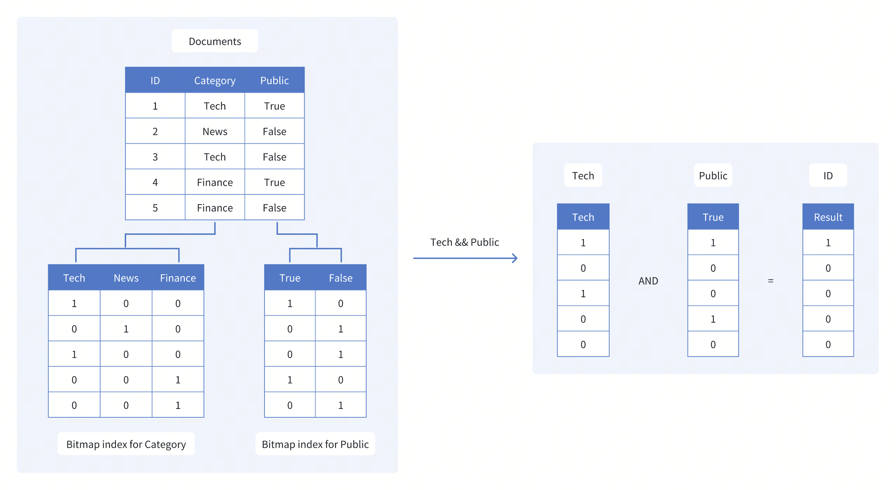

# BITMAP​

Bitmap indexing is an efficient indexing technique designed to improve query performance on low-cardinality scalar fields. Cardinality refers to the number of distinct values in a field. Fields with fewer distinct elements are considered low-cardinality.​

This index type helps reduce the retrieval time of scalar queries by representing field values in a compact binary format and performing efficient bitwise operations on them. Compared to other types of indexes, bitmap indexes typically have higher space efficiency and faster query speeds when dealing with low-cardinality fields.​

## Overview

The term Bitmap combines two words: **Bit** and **Map**. A bit represents the smallest unit of data in a computer, which can only hold a value of either **0** or **1**. A map, in this context, refers to the process of transforming and organizing data according to what value should be assigned to 0 and 1.​

A bitmap index consists of two main components: bitmaps and keys. Keys represent the unique values in the indexed field. For each unique value, there is a corresponding bitmap. The length of these bitmaps is equal to the number of records in the collection. Each bit in the bitmap corresponds to a record in the collection. If the value of the indexed field in a record matches the key, the corresponding bit is set to **1**; otherwise, it is set to **0**.​

Consider a collection of documents with fields **Category** and **Public**. We want to retrieve documents that fall into the **Tech** category and are open to the **Public**. In this case, the keys for our bitmap indexes are **Tech** and **Public**.​



As shown in the figure, the bitmap indexes for **Category** and **Public** are:​

- **Tech**: [1, 0, 1, 0, 0], which shows that only the 1st and 3rd documents fall into the **Tech** category.​

- **Public**: [1, 0, 0, 1, 0], which shows that only the 1st and 4th documents are open to the **Public**.​

To find the documents that match both criteria, we perform a bitwise AND operation on these two bitmaps:​

- **Tech** AND **Public**: [1, 0, 0, 0, 0]​

The resulting bitmap [1, 0, 0, 0, 0] indicates that only the first document (**ID** **1**) satisfies both criteria. By using bitmap indexes and efficient bitwise operations, we can quickly narrow down the search scope, eliminating the need to scan the entire dataset.​

## Create a bitmap index

To create a bitmap index in Milvus, use the `create_index()` method and set the `index_type` parameter to `"BITMAP"`.​

```Python
from pymilvus import MilvusClient​
​
index_params = client.create_index_params() # Prepare an empty IndexParams object, without having to specify any index parameters​
index_params.add_index(​
    field_name="category", # Name of the scalar field to be indexed​
    index_type="BITMAP", # Type of index to be created​
    index_name="category_bitmap_index" # Name of the index to be created​
)​
​
client.create_index(​
    collection_name="my_collection", # Specify the collection name​
    index_params=index_params​
)​

```

In this example, we create a bitmap index on the `category` field of the `my_collection` collection. The `add_index()` method is used to specify the field name, index type, and index name.​

Once the bitmap index is created, you can use the `filter` parameter in query operations to perform scalar filtering based on the indexed field. This allows you to efficiently narrow down the search results using the bitmap index. For more information, refer to <ins>Filtering</ins>.​

## Limits

- Bitmap indexes are supported only for scalar fields that are not primary keys.​

- The data type of the field must be one of the following:​

    - `BOOL`, `INT8`, `INT16`, `INT32`, `INT64`, `VARCHAR`​

    - `ARRAY` (elements must be one of: `BOOL`, `INT8`, `INT16`, `INT32`, `INT64`, `VARCHAR`)​

- Bitmap indexes do not support the following data types:​

    - `FLOAT`, `DOUBLE`: Floating-point types are not compatible with the binary nature of bitmap indexes.​

    - `JSON`: JSON data types have a complex structure that cannot be efficiently represented using bitmap indexes.​

- Bitmap indexes are not suitable for fields with high cardinality (i.e., fields with a large number of distinct values).​

    - As a general guideline, bitmap indexes are most effective when the cardinality of a field is less than 500.​

    - When the cardinality increases beyond this threshold, the performance benefits of bitmap indexes diminish, and the storage overhead becomes significant.​

    - For high-cardinality fields, consider using alternative indexing techniques such as inverted indexes, depending on your specific use case and query requirements.​